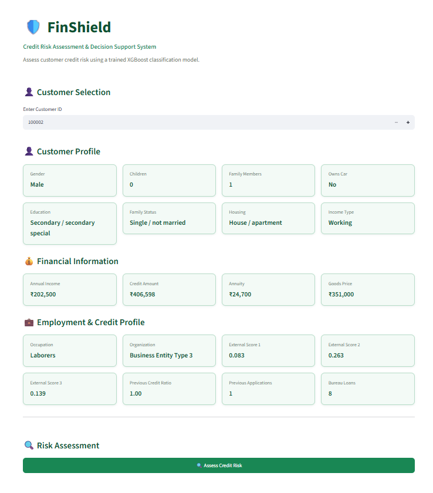
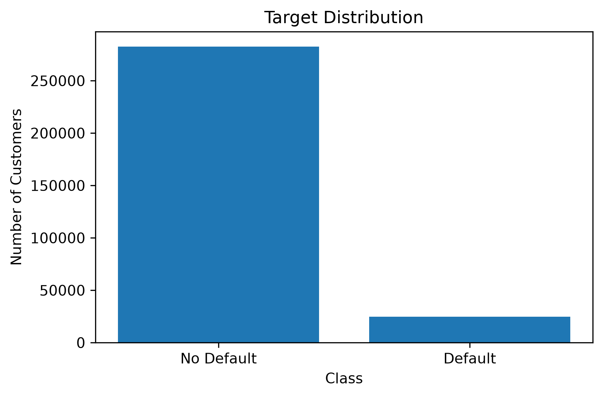
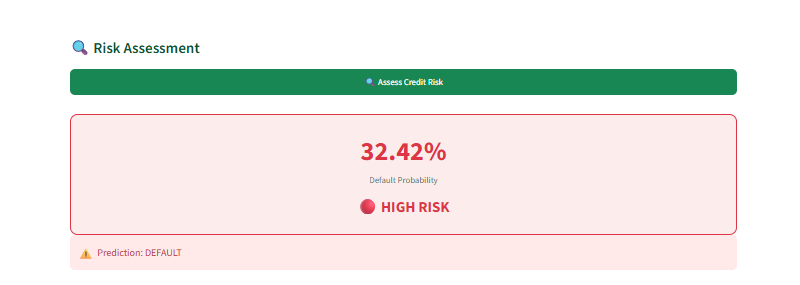
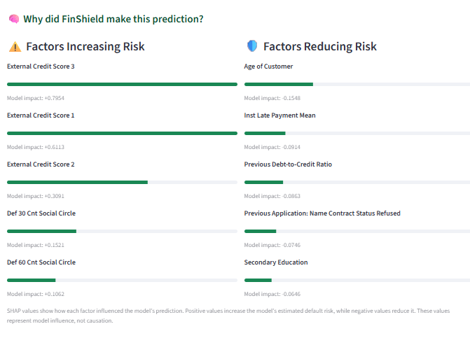

# 🛡️ FinShield
## Credit Risk Assessment & Decision Support System

FinShield is an end-to-end credit risk assessment system designed to analyze customer financial information, engineer credit-related features, predict loan default risk, and provide explainable risk insights through an interactive Streamlit application.

The project combines **SQL, Python, feature engineering, machine learning, explainable AI, and Streamlit deployment** into a complete credit-risk analytics pipeline.

---

## 📌 Project Overview

Credit risk assessment is an important problem in financial institutions because incorrectly approving high-risk customers can result in financial losses.

FinShield uses historical customer and credit information to:

- Analyze customer financial and credit behavior
- Engineer customer-level credit risk features
- Build and compare multiple machine learning models
- Predict the probability of loan default
- Optimize the classification threshold for better minority-class detection
- Explain individual predictions using SHAP
- Provide an interactive customer-level risk assessment dashboard

## 🖥️ FinShield Dashboard


---

## 🎯 Business Problem

Financial institutions need reliable methods to identify customers who may have a higher probability of defaulting on loans.

A simple accuracy-based model can be misleading in credit-risk problems because default cases represent a minority class.

Therefore, FinShield focuses on:

- Identifying potential defaulters
- Improving recall for the default class
- Balancing precision and recall
- Providing interpretable model predictions
- Supporting customer-level credit risk assessment

---

## 🎯 Project Objectives

1. Perform structured data analysis using SQL and Python.
2. Build customer-level features from multiple credit datasets.
3. Create a unified master dataset.
4. Perform data cleaning and exploratory data analysis.
5. Train and compare multiple classification models.
6. Select the most suitable model using F1-score and ROC-AUC.
7. Optimize the classification threshold.
8. Explain individual predictions using SHAP.
9. Build an interactive Streamlit risk assessment application.

---

# 📊 Dataset

The project uses the **Home Credit Default Risk** dataset.

The dataset contains information related to:

- Customer applications
- Previous loan applications
- Credit bureau records
- Bureau balance history
- Installment payments
- Credit card balances
- POS cash balances

### Major datasets

```text
application_train.csv
application_test.csv
bureau.csv
bureau_balance.csv
previous_application.csv
installments_payments.csv
credit_card_balance.csv
POS_CASH_balance.csv
```

The main target variable is:

```text
TARGET
```

where:

```text
0 → Non-default
1 → Default
```

---

# 🏗️ Project Architecture

```text
Raw CSV Files
      │
      ▼
PostgreSQL Database
      │
      ▼
SQL Analysis & Validation
      │
      ▼
Feature Engineering
      │
      ├── Bureau Features
      ├── Bureau Balance Features
      ├── Previous Application Features
      ├── POS Cash Features
      ├── Installment Features
      └── Credit Card Features
      │
      ▼
Feature Merging
      │
      ▼
Master Dataset
      │
      ▼
Data Cleaning
      │
      ▼
EDA & Feature Analysis
      │
      ▼
One-Hot Encoding
      │
      ▼
Machine Learning
      │
      ├── Logistic Regression
      ├── Random Forest
      ├── XGBoost
      └── LightGBM
      │
      ▼
Model Evaluation
      │
      ▼
Threshold Optimization
      │
      ▼
Final XGBoost Model
      │
      ├── SHAP Explainability
      │
      ▼
Streamlit Dashboard
```

---

# 🗄️ Data Engineering & SQL

PostgreSQL was used to store and analyze the raw datasets.

SQL analysis was performed to understand:

- Dataset structure
- Customer distributions
- Missing values
- Credit behavior
- Previous applications
- Installment payment behavior
- Credit card utilization
- POS cash behavior
- Bureau records
- Customer-level relationships

Validation queries were also created to verify the results of the feature engineering process.

---

# ⚙️ Feature Engineering

Multiple historical credit datasets were transformed into customer-level features using aggregation and feature construction techniques.

## Bureau Features

Created customer-level statistics from bureau credit records, including:

- Credit amount statistics
- Credit duration
- Active loan counts
- Overdue information
- Credit status information
- Aggregated historical credit behavior

The bureau aggregation produced **63 customer-level features**.

## Bureau Balance Features

Bureau balance history was aggregated to capture:

- Account status counts
- Balance history
- Number of months recorded
- Historical account behavior

Categorical status values were converted into numerical count-based features.

## Previous Application Features

Previous applications were aggregated to capture:

- Previous credit amounts
- Previous application amounts
- Previous annuity values
- Contract statuses
- Contract types
- Application history

Additional ratio features were created:

```text
Previous Credit / Previous Application
Previous Annuity / Previous Credit
```

## Other Feature Groups

Customer-level features were also generated from:

- POS Cash balances
- Installment payments
- Credit card balances

---

# 🔗 Feature Merging

All engineered feature datasets were merged using:

```text
SK_ID_CURR
```

The result is a unified customer-level master dataset containing information from the application table and historical credit datasets.

---

# 🧹 Data Cleaning

The master dataset was cleaned before machine learning.

The preprocessing stage included:
- Handling missing values
- Removing unsuitable columns
- Preparing categorical variables
- Preparing numerical variables
- Removing the target from prediction features
- Preparing consistent training and prediction feature sets

The cleaned dataset was saved as:

```text
data/final/clean_master_dataset.csv
```

---

# 📈 Exploratory Data Analysis

EDA was performed to understand customer characteristics and identify patterns relevant to credit risk.

Analysis included:
- Target distribution
- Numerical feature distributions
- Outlier analysis
- Correlation analysis
- Feature relationships

Generated visualizations include:

```text
target_distribution.png
correlation_heatmap.png

AMT_INCOME_TOTAL_histogram.png
AMT_INCOME_TOTAL_boxplot.png

AMT_CREDIT_histogram.png
AMT_CREDIT_boxplot.png

AMT_ANNUITY_histogram.png
AMT_ANNUITY_boxplot.png

AMT_GOODS_PRICE_histogram.png
AMT_GOODS_PRICE_boxplot.png

DAYS_BIRTH_histogram.png
DAYS_BIRTH_boxplot.png

DAYS_EMPLOYED_histogram.png
DAYS_EMPLOYED_boxplot.png
```


---

# 🤖 Machine Learning

The problem was treated as a binary classification task.

The following models were evaluated:

- Logistic Regression
- Random Forest
- XGBoost
- LightGBM

Categorical variables were converted using **one-hot encoding**.

The final encoded feature matrix contained:

```text
432 features
```
---

# 📊 Model Comparison

| Model | Accuracy | Precision | Recall | F1 Score | ROC-AUC |
|---|---:|---:|---:|---:|---:|
| Logistic Regression | 0.9190 | 0.4679 | 0.0264 | 0.0500 | 0.7733 |
| Random Forest | 0.7598 | 0.1851 | 0.5805 | 0.2807 | 0.7507 |
| XGBoost | **0.8540** | **0.2645** | **0.4538** | **0.3342** | **0.7845** |
| LightGBM | 0.8545 | 0.2636 | 0.4475 | 0.3318 | 0.7831 |

---

# 🏆 Final Model — XGBoost

XGBoost was selected as the final model because it achieved the highest:

```text
F1 Score  = 0.3342
ROC-AUC   = 0.7845
```

The selection prioritizes the model's ability to identify the minority default class rather than simply maximizing accuracy.

### Final Evaluation

```text
Accuracy  : 0.8540
Precision : 0.2645
Recall    : 0.4538
F1 Score  : 0.3342
ROC-AUC   : 0.7845
```

### Confusion Matrix

```text
[[50273, 6265],
 [ 2712, 2253]]
```

---

# 🎚️ Threshold Optimization

The default classification threshold was evaluated at multiple values.

| Threshold | Precision | Recall | F1 Score |
|---:|---:|---:|---:|
| 0.30 | 0.3810 | 0.1641 | 0.2294 |
| 0.25 | 0.3519 | 0.2302 | 0.2783 |
| 0.20 | 0.3121 | 0.3257 | 0.3187 |
| **0.15** | **0.2645** | **0.4538** | **0.3342** |

The final classification threshold was set to:

```text
0.15
```

This threshold achieved the highest F1-score among the evaluated thresholds while substantially improving recall for the default class.

In a credit-risk setting, identifying potential defaulters is important because false negatives can carry significant business costs.

---

# 🧠 Explainable AI — SHAP

FinShield uses **SHAP (SHapley Additive exPlanations)** to explain individual XGBoost predictions.

For each customer, the dashboard displays:

### Factors Increasing Risk

Features with positive SHAP values that increase the model's estimated default risk.

### Factors Reducing Risk

Features with negative SHAP values that reduce the model's estimated default risk.

Example factors can include:

- External credit scores
- Age
- Installment payment behavior
- Previous credit ratios
- Previous application history
- Credit amounts

SHAP values represent **model influence, not causation**.

---

# 🖥️ Streamlit Dashboard

FinShield includes an interactive Streamlit application for customer-level credit risk assessment.

## Customer Selection

Users can enter a customer ID to retrieve the customer's information from the cleaned master dataset.

## Customer Profile

The dashboard displays important customer information such as:

- Gender
- Children
- Family members
- Car ownership
- Education
- Family status
- Housing type
- Income type

## Employment & Credit Profile

The dashboard displays:

- Occupation
- Organization type
- External credit scores
- Previous credit ratio
- Previous applications
- Bureau loans

## Risk Assessment

The dashboard displays the model-estimated default probability and prediction.

Example:

```text
Default Probability: 32.42%

🔴 HIGH RISK

Prediction: DEFAULT
```


## Dashboard Risk Bands

For easier interpretation, the dashboard visually categorizes model-estimated probabilities into three risk bands:

```text
< 10%       → 🟢 LOW RISK
10% - <20%  → 🟠 MEDIUM RISK
≥ 20%       → 🔴 HIGH RISK
```

These dashboard risk bands are used for **presentation and interpretation**.

They do not replace the model's classification threshold of:

```text
0.15
```

Therefore, a customer can be displayed as **MEDIUM RISK** while the model prediction is still **NON-DEFAULT** if the probability is below 15%.

## Explainable Prediction

The dashboard also provides SHAP-based explanations showing which features had the strongest influence on the prediction.


---

# 📂 Project Structure

```text
FinShield/
│
├── app/
│   └── app.py
│
├── data/
│   ├── raw/
│   ├── processed/
│   └── final/
│
├── database/
│   ├── application_bureau_analysis.sql
│   ├── application_test_analysis.sql
│   ├── application_test_validation.sql
│   ├── application_validation.sql
│   ├── bureau_validation.sql
│   ├── bureau_balance_analysis.sql
│   ├── bureau_balance_validation.sql
│   ├── credit_card_analysis.sql
│   ├── credit_card_validation.sql
│   ├── installments_analysis.sql
│   ├── installments_validation.sql
│   ├── pos_cash_analysis.sql
│   ├── pos_cash_validation.sql
│   ├── previous_application_analysis.sql
│   └── previous_application_validation.sql
│
├── models/
│   ├── xgboost_model.pkl
│   ├── xgboost_features.pkl
│   ├── logistic_regression_model.pkl
│   ├── logistic_regression_scaler.pkl
│   ├── random_forest_model.pkl
│   └── lightgbm_model.pkl
│
├── reports/
│   └── figures/
│
├── results/
│   ├── model_comparison.csv
│   ├── threshold_comparison.csv
│   └── final_model_metrics.txt
│
├── src/
│   ├── analysis/
│   ├── feature_configs/
│   ├── feature_engineering/
│   ├── ingestion/
│   ├── inspection/
│   ├── preprocessing/
│   ├── modeling/
│   ├── config.py
│   ├── database.py
│   └── utils.py
│
├── README.md
└── requirements.txt
```

---

# 🛠️ Technologies Used

## Programming

- Python
- SQL

## Data Analysis

- Pandas
- NumPy
- Matplotlib
- Seaborn

## Database

- PostgreSQL
- SQLAlchemy
- psycopg2

## Machine Learning

- Scikit-learn
- XGBoost
- LightGBM

## Explainable AI

- SHAP

## Deployment

- Streamlit

## Development Tools

- Jupyter Notebook
- VS Code
- Git
- GitHub
---

# 📌 Key Skills Demonstrated

This project demonstrates practical experience in:

- Data ingestion
- SQL analysis
- PostgreSQL
- Data validation
- Feature engineering
- Feature aggregation
- Data cleaning
- Exploratory Data Analysis
- One-hot encoding
- Imbalanced classification
- Machine learning model comparison
- XGBoost
- Threshold optimization
- Model evaluation
- SHAP explainability
- Streamlit application development
- Git and GitHub
- End-to-end ML workflow

---

# 📊 Key Results

The completed system provides:

```text
Final Model        : XGBoost
F1 Score           : 0.3342
ROC-AUC            : 0.7845
Selected Threshold : 0.15
Encoded Features   : 432
```

The system successfully connects:

```text
Data Engineering
        ↓
SQL Analysis
        ↓
Feature Engineering
        ↓
Machine Learning
        ↓
Model Explainability
        ↓
Interactive Risk Assessment
```

---

# 🚀 Installation

Clone the repository:

```bash
git clone <repository-url>
cd FinShield
```

Create a virtual environment:

### Windows

```bash
python -m venv venv
venv\Scripts\activate
```

### Linux / macOS

```bash
python -m venv venv
source venv/bin/activate
```

Install dependencies:

```bash
pip install -r requirements.txt
```

Configure the PostgreSQL connection in the project configuration.

---

# ▶️ Running the Application

Start the Streamlit dashboard:

```bash
streamlit run app/app.py
```

The application allows users to:

1. Enter a customer ID.
2. View the customer's profile.
3. View financial and credit information.
4. Assess credit risk.
5. View the model-estimated default probability.
6. View the risk category.
7. View the model prediction.
8. Inspect SHAP-based risk factors.

---

# 🔮 Future Improvements

Potential future improvements include:

- Probability calibration
- Cost-sensitive model optimization
- Hyperparameter tuning
- Cross-validation
- Advanced class-imbalance techniques
- Model monitoring
- Automated data pipelines
- Cloud deployment
- API-based model serving
- More detailed business decision rules
- Interactive historical customer analysis

---


# 👤 Author

**Afrin Taj**

Aspiring Data Scientist | Machine Learning | Data Analytics
